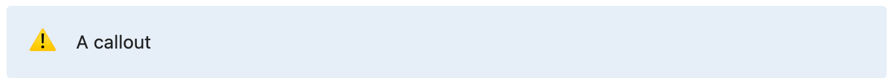

# wodaochu-markdown
`wodaochu-markdown` is a tool that can export your wolai page to markdown document.

## Get started
### Installation
Install with `go get`:
```bash
go install github.com/lemonnekogh/wodaochu-markdown@latest
```
### Usage
```bash
wodaochu-markdown <your-token> <page-id> <output-dir>
```

## Block converting behaviors
### Callout
Callout will be converted to containers, marquee mode not supported currently, font awesome icon not supported currently.

Example:


It will be convert to:
```markdown
::: TIP ⚠️
A callout.
:::
```
### Embed
Embed will be converted to [iframe](https://developer.mozilla.org/en-US/docs/Web/HTML/Element/iframe), but we cannot set the height of iframe because the API does not return this field.

## Extended syntaxes support in markdown parsers
### [Task lists](https://www.markdownguide.org/extended-syntax/#task-lists)
- `markdown-it` - The [`markdown-it-task-lists`](https://www.npmjs.com/package/@hackmd/markdown-it-task-lists) plugin provides support of it, but it does not contains `typescript` definition.

### [Footnotes](https://www.markdownguide.org/extended-syntax/#footnotes)
- `markdown-it` - The [`markdown-it-footnote`](https://www.npmjs.com/package/markdown-it-footnote) plugin provides support of it.

### Equations
- `markdown-it` - The [`markdown-it-mathjax3`](https://www.npmjs.com/package/markdown-it-mathjax3) plugin provides support of it.

### Containers
- `markdown-it` - The [`markdown-it-container`](https://www.npmjs.com/package/markdown-it-container) plugin provides support of it.
